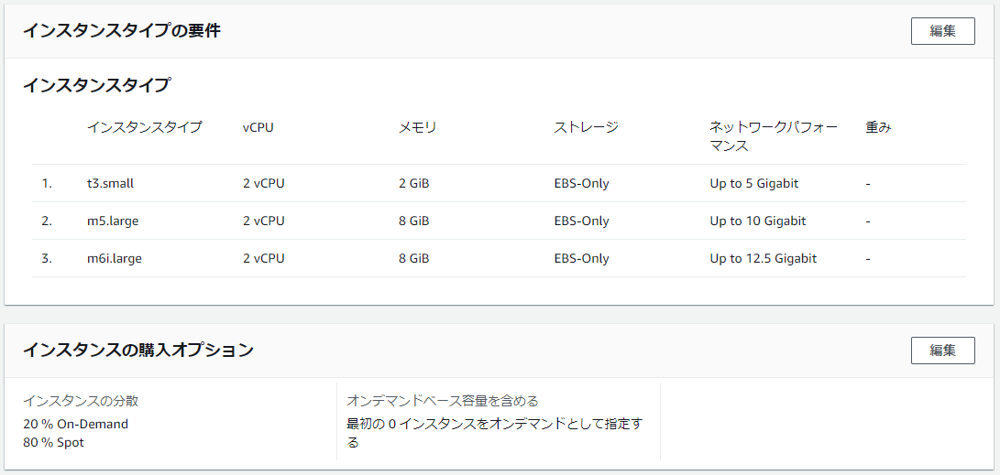
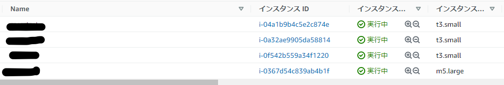
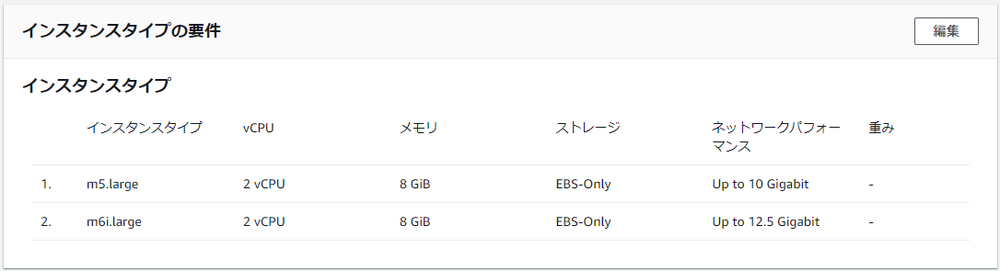
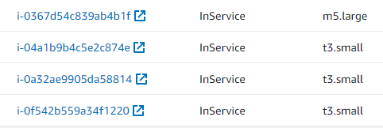

ASGのインスタンスタイプの変更は、変更してから即インスタンスが置き換わるのではなく、新規にインスタンス起動時にASGの設定が適用されていくイメージ

4台起動する

起動するインスタンスタイプはt3, m5, m6i

起動しているインスタンス状態 t3: 3台、m5: 1台

起動するインスタンスタイプからt3を削除

ASGの設定を変更しても、t3インスタンスは勝手に落とされない

t3のインスタンスを落とす

新しくm5インスタンスが起動

他のt3インスタンスを落としたら、ちゃんとt3以外が起動しているのを確認

