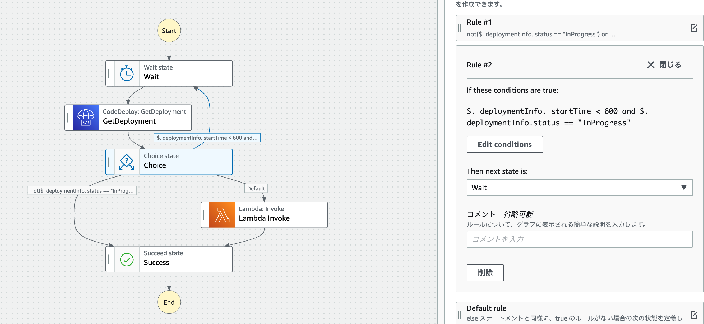

[AWS Step Functions をゼロからざっくり理解する](https://dev.classmethod.jp/articles/aws-step-functions-for-beginner/)

[AWS Step Functionsでネストされたwhileループを実装する方法](https://dev.classmethod.jp/articles/how-to-implement-a-nested-while-loop-in-aws-step-functions-in-japanese/)

CodeDeployのデプロイ時間のモニタリング例

