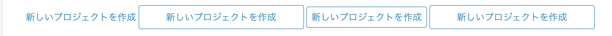

[Tailwind Standalone for Phoenix](https://fly.io/phoenix-files/tailwind-standalone/)

[Tailwind CSS は Elixir なら Node.js 不要の Phoenix 準公式ライブラリ「Tailwind」ですぐに使える](https://qiita.com/piacerex/items/c2e6b1763fbcc7679e67)

[Install Tailwind CSS with Phoenix](https://tailwindcss.com/docs/guides/phoenix)  
公式ドキュメント

[npmを使ったインストール方法: phx_gen_tailwind](https://github.com/kevinlang/phx_gen_tailwind)


button() と link()

```
# 画面遷移後、URLに?_csrf_token=&_method=getが追加される
button(gettext("create a new project"), to: Routes.account_project_path(@conn, :new), method: :get)

# 画面遷移後、URLには特に何も表示されない
link(gettext("create a new project"), to: Routes.account_project_path(@conn, :new))
```

link()ではHTMLにaタグとしてレンダリングされる。aタグはインライン要素のため、高さ・幅指定が効かない！そのため、`display: inline-block`を適用すればbuttonタグのように扱える  
[【CSS/html】aタグの幅(width)を変える方法](https://csshtml.work/a-width/)

```
    <%= link(gettext("create a new project"), to: Routes.account_project_path(@conn, :new), class: "text-content-link hover:underline") %>
    <%= link(gettext("create a new project"), to: Routes.account_project_path(@conn, :new), class: "w-1/4 text-center p-2 bg-white text-button-1 rounded border border-button-1 hover:bg-button-2 hover:border-button-2 hover:text-white transition duration-300 inline-block") %>
    <%= link(gettext("create a new project"), to: Routes.account_project_path(@conn, :new), class: "w-1/4 text-center p-2 bg-white text-button-1 rounded border border-button-1 hover:bg-button-2 hover:border-button-2 hover:text-white transition duration-300") %>
    <%= button(gettext("create a new project"), to: Routes.account_project_path(@conn, :new), method: :get, class: "w-1/4 text-center p-2 bg-white text-button-1 rounded border border-button-1 hover:bg-button-2 hover:border-button-2 hover:text-white transition duration-300 inline") %>
```



### CSSのネスト

[Adding Tailwind CSS to Phoenix 1.6](https://pragmaticstudio.com/tutorials/adding-tailwind-css-to-phoenix)

@applyでtailwindで提供されるクラスを組み合わせることができる

```
@import "tailwindcss/base";
@import "tailwindcss/components";
@import "tailwindcss/utilities";

.card {
  @apply p-4 bg-blue-200 text-blue-800 rounded-lg;
}

.card .title {
  @apply text-2xl tracking-tight font-bold;
}

.card .description {
  @apply pt-4 text-lg font-medium;
}

.card .description a {
  @apply underline text-blue-600;
}
```

以下みたいに、`@layer components{}`をつけると`.phx-submit-loading`がLiveviewでhtmlに追加された時、うまくスタイル適用されなかったから注意！

```
@layer components{
  .card {
    @apply p-4 bg-blue-200 text-blue-800 rounded-lg;
  }
}
```

[Phoenix LiveView Tailwind Variants](https://fly.io/phoenix-files/phoenix-liveview-tailwind-variants/)  
[Variantについて](https://tailwindcss.com/docs/plugins#adding-variants)

これにより、Liveviewのイベントphx-submit-loadingなどで、`hover:xxx` や `focus:xxx` みたいに、`phx-submit-loading:xxx` の ような記述をCSSにできる

```js assets/tailwind.config.js
const plugin = require('tailwindcss/plugin')

module.exports = {
  content: [
    "./js/**/*.js",
    "../lib/*_web.ex",
    "../lib/*_web/**/*.*ex"
  ],
  theme: {
    extend: {},
  },
  plugins: [
    require("@tailwindcss/forms"),
    plugin(({addVariant}) => addVariant('phx-no-feedback', ['&.phx-no-feedback', '.phx-no-feedback &'])),
    plugin(({addVariant}) => addVariant('phx-click-loading', ['&.phx-click-loading', '.phx-click-loading &'])),
    plugin(({addVariant}) => addVariant('phx-submit-loading', ['&.phx-submit-loading', '.phx-submit-loading &'])),
    plugin(({addVariant}) => addVariant('phx-change-loading', ['&.phx-change-loading', '.phx-change-loading &']))
  ]
}
```

```html hogehoge.html.heex
<button
  phx-click="send"
  phx-disable-with="Sending..."
  class="p-4 rounded-lg bg-indigo-600 phx-click-loading:animate-pulse"
>
  Send!
</button>
```

[animate-pulse](https://tailwindcss.com/docs/animation#pulse)

[DaisyUIインストール周りのフォーラムのやりとり(How to get DaisyUI and Phoenix to work?)](https://elixirforum.com/t/how-to-get-daisyui-and-phoenix-to-work/46612)

[heroicon用のelixir ライブラリ](https://github.com/mveytsman/heroicons_elixir/blob/main/LICENSE)  
`<Heroicons.cake />`みたいな感じで埋め込めるが、普通にheroiconのsvgコピペでも良さそう  
[[HTML/icon.md]]
